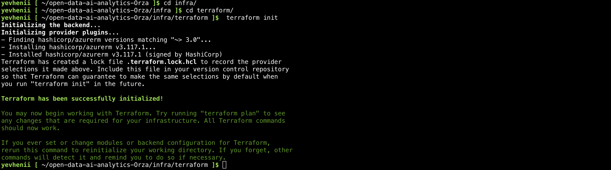
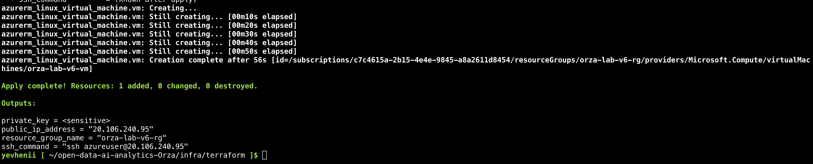

# Звіт про виконання лабораторної роботи №4
**Тема:** Автоматизація розгортання інфраструктури в Azure за допомогою Terraform

**Виконав:** Орза Євгеній Сергійович
**Група:** ШІ-33
**Кафедра:** СШІ, НУ «Львівська політехніка»

---

## 1. Огляд виконаних робіт
Було реалізовано повний цикл автоматизації інфраструктури:
- Створено конфігурацію Terraform для розгортання віртуальної машини в Azure.
- Налаштовано мережеві правила (NSG) для доступу до SSH (22) та HTTP (80, 8501).
- Використано `cloud-init` для автоматичного встановлення Docker та клонування проекту.

## 2. Результати розгортання
Інфраструктура була успішно розгорнута в регіоні **East US** з використанням VM розміру **Standard_DC1ds_v3**.

### Скріншоти виконання:

*Рис. 1. Процес виконання команди terraform apply.*

*Рис. 2. Список ресурсів у порталі Azure.*

*Рис. 3. Результат роботи Streamlit-додатку на публічній IP-адресі.*

## 3. Висновки
Завдяки використанню Terraform вдалося досягти повної повторюваності інфраструктури. Проблеми з квотами Azure були вирішені шляхом підбору доступного SKU та регіону.
https://github.com/EvheniiOrza/open-data-ai-analytics-Orza