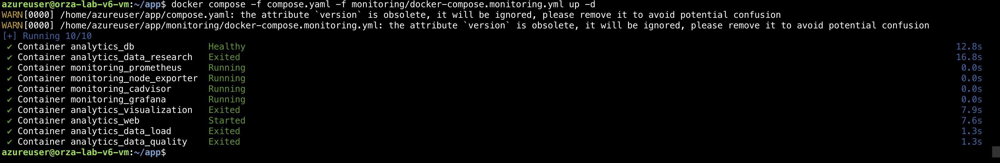

# Звіт про виконання лабораторної роботи №5
**Тема:** Впровадження системи моніторингу (Observability) для хмарної інфраструктури

**Виконав:** Орза Євгеній Сергійович
**Група:** ШІ-33
**Кафедра:** СШІ, НУ «Львівська політехніка»

---

## 1. Мета роботи
Додати систему моніторингу до існуючого проекту для відстеження стану сервера та контейнерів у реальному часі.

## 2. Компоненти системи моніторингу
Було розгорнуто стек **Prometheus + Grafana + Node Exporter + cAdvisor**:
- **Prometheus**: збір та зберігання метрик.
- **Grafana**: візуалізація даних на дашбордах.
- **Node Exporter**: метрики заліза (CPU, RAM, Disk).
- **cAdvisor**: метрики Docker-контейнерів.

## 3. Оновлення інфраструктури
У Terraform було додано правила для портів моніторингу:
- **3000**: Grafana Web UI.
- **9090**: Prometheus Web UI.

### Скріншоти виконання:

*Рис. 1. Додавання правил NSG для моніторингу.*

*Рис. 2. Налаштований дашборд у Grafana (Node Exporter).*

*Рис. 3. Стан віртуальної машини після розгортання всіх компонентів.*

## 4. Висновки
Впровадження моніторингу дозволило отримати повну видимість роботи проекту. Тепер можна відстежувати пікові навантаження під час обробки даних у реальному часі.
