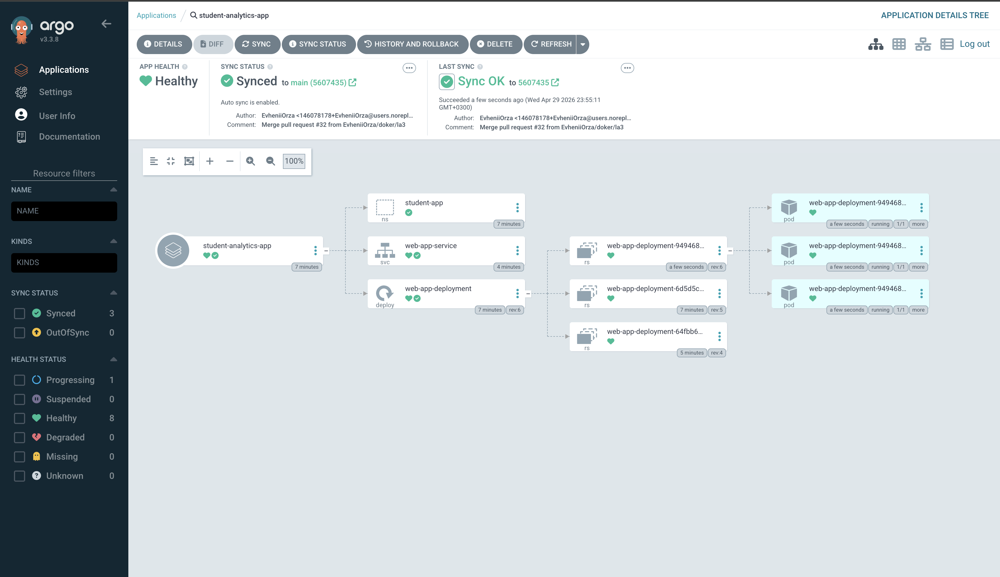

# Звіт про виконання лабораторної роботи №6
**Тема:** Автоматизація розгортання застосунків через Argo CD (GitOps)

**Виконав:** Орза Євгеній Сергійович
**Група:** ШІ-33
**Кафедра:** СШІ, НУ «Львівська політехніка»

---

## 1. Мета роботи
Ознайомлення з принципами GitOps та налаштування автоматизованого циклу розгортання (CD) за допомогою Argo CD у Kubernetes-кластері k3s. Суть підходу полягає в тому, що Git є єдиним джерелом істини (Single Source of Truth).

## 2. Результати розгортання
В ході роботи було розгорнуто кластер k3s та встановлено Argo CD. Всі маніфести додатку були синхронізовані автоматично після виправлення конфігурації в репозиторії.

### Скріншоти виконання:

*Рис. 1. Результат успішної синхронізації Argo CD (Status: Synced & Healthy).*

*Рис. 2. Перевірка запущених подів та сервісів через kubectl.*

*Рис. 3. Доступ до розгорнутого застосунку через NodePort кластера.*

## 3. Переваги GitOps
Під час виконання лабораторної роботи було продемонстровано:
- **Автоматична синхронізація**: після пушу змін у Git (виправлення протоколу TCP), Argo CD автоматично оновив ресурси в кластері.
- **Декларативність**: вся інфраструктура описана у вигляді YAML-файлів, що дозволяє легко відстежувати зміни.
- **Надійність**: швидке виявлення розбіжностей (drift detection) між Git та кластером.

## 4. Висновок
У ході виконання циклу лабораторних робіт було побудовано повноцінну хмарну інфраструктуру в Azure: від опису ресурсів у Terraform та контейнеризації Docker до сучасного GitOps розгортання в Kubernetes. Проект готовий до промислової експлуатації та моніторингу.
