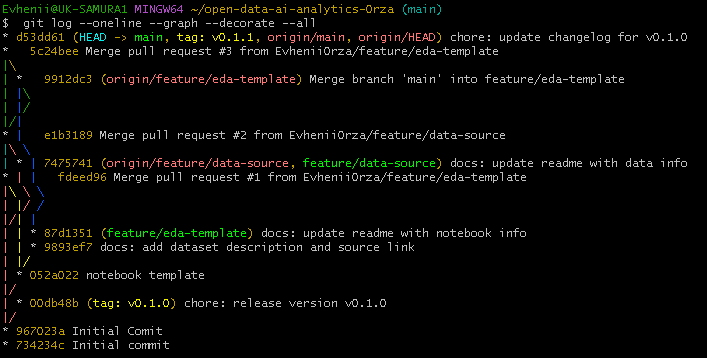
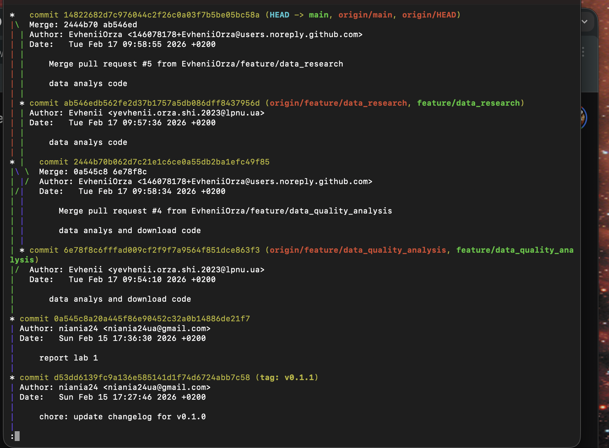

# Звіт про виконання лабораторної роботи

## Виконані завдання:
У ході роботи було розгорнуто локальний Git-репозиторій та створено чітку структуру папок (`data`, `notebooks`, `src`). Було реалізовано роботу у двох тематичних гілках: `feature/data-source` для опису датасету реєстрацій ТЗ та `feature/eda-notebook` для створення шаблону аналізу. 
### Граф історії комітів:

## Труднощі та їх вирішення:
Найбільшою проблемою став конфлікт злиття (merge conflict) у файлі `README.md`, який виник через одночасне редагування однієї секції в різних гілках. Конфлікт було розв'язано вручну шляхом редагування маркерів Git та комбінування тексту. Також виникали труднощі з навігацією в редакторі Vim під час комітів.

## Опис виконаних робіт:

Quality Analysis: Реалізовано перевірку на null значення та відповідність типів даних стовпців CAPACITY та OWN_WEIGHT.

Research: Проаналізовано структуру ринку, виявлено лідерів серед брендів (наприклад, Volkswagen та Renault).

Visualization: Побудовано гістограму розподілу транспортних засобів за типом палива (Бензин/Дизель/Електро).

Git Flow: Успішно розв'язано merge-конфлікт у файлі README.md при об'єднанні гілок дослідження та перевірки якості.

## Результат:
Репозиторій містить понад 8 логічних комітів, історія версій структурована, додано файл CHANGELOG.md та створено релізний тег v0.1.0.
* [Мій репозиторій](https://github.com/EvheniiOrza/open-data-ai-analytics-Orza)
* [Pull Request з аналізом](https://github.com/EvheniiOrza/open-data-ai-analytics-Orza/pull/3)
* [Pull Requests](https://github.com/EvheniiOrza/open-data-ai-analytics-Orza/pulls?q=is%3Apr+is%3Aclosed)
* [Джерело даних (Data.gov.ua)](https://data.gov.ua/dataset/06779371-308f-42d7-895e-5a39833375f0)